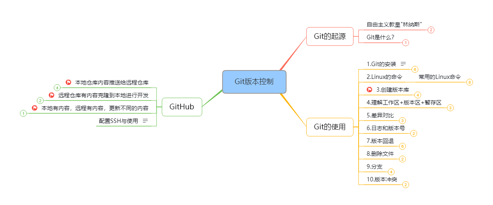

# 里程碑

## 2022.1.1
### 不知不觉，到了新的一年啦，开启新的生活，祝愿平安幸福，为梦想继续添把火，加把力！

## 2022.1.2

1. git：
    - Git和SVN有什么区别？
        git是分布式控制管理系统，属于第三代，客户端可以在本地系统上克隆整个仓库，即使离线也可提交，可以用commit共享
    - 什么是Git？

    - 在 Git 中提交的命令是什么？

    - 什么是 Git 中的“裸存储库”？

    - Git 是用什么语言编写的？

2. git使用：
    - 在Git中，你如何还原已经 push 并公开的提交？

    - git pull 和 git fetch 有什么区别？

    - git中的“staging area”或“index”是什么？

    - 什么是 git stash?

    - 什么是git stash drop？

    - 如何找到特定提交中已更改的文件列表？

    - git config 的功能是什么？

    - 提交对象包含什么？

    - 如何在Git中创建存储库？

    - 怎样将 N 次提交压缩成一次提交？
    
    - 什么是 Git bisect？如何使用它来确定（回归）错误的来源？

    - 如果想要在提交之前运行代码性检查工具，并在测试失败时阻止提交，该怎样配置 Git 存储库？

    - 描述一下你所使用的分支策略？

    - 如果分支是否已合并为master，你可以通过什么手段知道？

    - 什么是SubGit？
## 2022.1.3

## 2022.1.4

## 2022.1.5

## 2022.1.6

## 2022.1.7

## 2022.1.8

## 2022.1.9

## 2022.1.10

