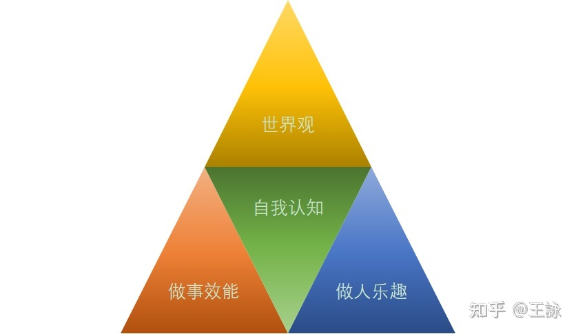

# 里程碑

## 2022.1.1
### 不知不觉，到了新的一年啦，开启新的生活，祝愿平安幸福，为梦想继续添把火，加把力！

## 2022.1.2


1. git：
    - Git和SVN有什么区别？
      <br/> git是分布式控制管理系统，属于第三代，客户端可以在本地系统上克隆整个仓库，即使离线也可提交，可以用commit共享;
      <br/> svn是集中版本控制，不能共享，
    - 什么是Git？
      <br/> git是分布式版本控制系统
    - 在 Git 中提交的命令是什么？
      ```
      git commit -m ""
      ```
    - 什么是 Git 中的“裸存储库”？
      <br/>git的裸存储库,没有工作目录
    - Git 是用什么语言编写的？
      <br/> git使用C语言，减少运行时的开销
2. git使用：
    - 在Git中，你如何还原已经 push 并公开的提交？
      可以通过 git revert 加上提交的名字
      或者修改后重新再提交
    - git pull 和 git fetch 有什么区别？
      * git pull 相当于先从远程拉代码，然后再本地合并，相当于 git fetch + git merge
      * git fetch 
    - git中的“staging area”或“index”是什么？

    - 什么是 git stash?

    - 什么是git stash drop？

    - 如何找到特定提交中已更改的文件列表？

    - git config 的功能是什么？

    - 提交对象包含什么？

    - 如何在Git中创建存储库？

    - 怎样将 N 次提交压缩成一次提交？
    
    - 什么是 Git bisect？如何使用它来确定（回归）错误的来源？

    - 如果想要在提交之前运行代码性检查工具，并在测试失败时阻止提交，该怎样配置 Git 存储库？

    - 描述一下你所使用的分支策略？

    - 如果分支是否已合并为master，你可以通过什么手段知道？

    - 什么是SubGit？
## 2022.1.3



* 这代表四个学习方向， 人生的两大根基，做事的效能，做人的乐趣，高效能，慢生活，一紧一松，平衡我们的生活。最中心的是一个人的自我认知，表示我们最为核心需要探究的命题。世界观是我们抬头学习的，是视野学习。
>  学习做事的效能---技能型学习
>> * 工作上，开发一个项目，做一次汇报，写一个方案，与同事交流工作细节
>> * 生活上，做饭，整理家务，和家人沟通，辅导学生写作业

---
>  培养做人的乐趣---提升幸福感学习
>> * 培养一份艺术方面的爱好，绘画，乐器
>> * 培养一项运动习惯，跳舞，瑜伽，慢跑
---
>  学习自我认知---认识与自愈自我学习
>> * 通过心理学，哲学的学习，更好的自我自愈，自我认识
---
>  升级个人世界观---潜移默化的巨变
>> * 了解人类历史，
>> * 科技转型
>> * 社会变化
>> * 行业融合
---
总结： 现阶段的我应该从生活和工作两个维度，寻找当下用得最多，最能为我提供价值的技能学习。
## 2022.1.4
```
['1', '2', '3'].map(parseInt)
```
答案是什么，为什么？
* 答案是 [1,NaN, NaN]
* map(item, index) 当前元素 与 索引
* parseInt 解析字符串为制定基数的整数类型
* parseInt传参数 （string，radix） 需要解析的字符串，基数
* 所以呢
* 第一个（'1', 0） 基数为0，参数不以‘0x’ '0'开头，按10基数处理，返回1
* 第二个 ('2', 1) 基数为1 最大值为1，大于2，无法解析，返回NaN
* 第三个 ('3', 2) 基数为2，最大值为2，小于3，无法解析，返回NaN
## 2022.1.5

## 2022.1.6

## 2022.1.7

## 2022.1.8

## 2022.1.9

## 2022.1.10

